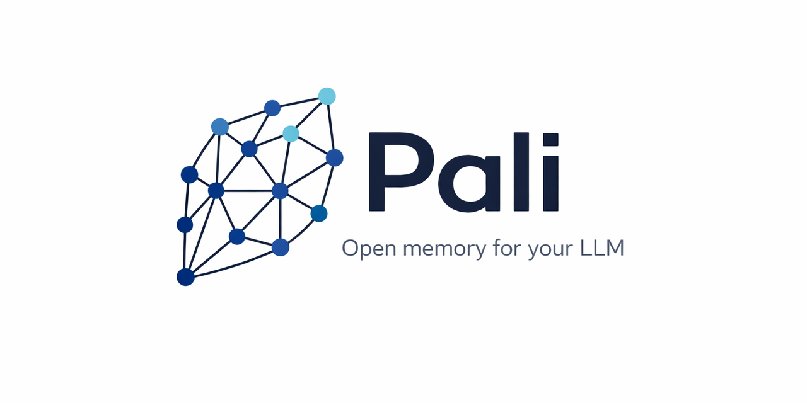
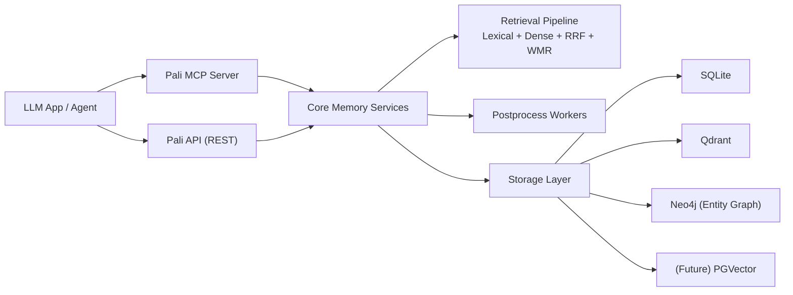

<div align="center">

# Pali

[](https://go.dev/)
[](LICENSE)
[](README.md)



*Open memory for your LLM.*

</div>

> **Early Beta** — Pali is functional but under active development. APIs and configuration formats may change between releases. If you run into problems with your setup, config, or provider combination, please [open an issue](https://github.com/pali-mem/pali/issues) — it helps a lot.

Pali is very early in development and not yet a complete memory solution. Current focus is getting the infrastructure right first.

Pali is infrastructure-first:
- Multi-tenant memory APIs
- Hybrid retrieval (lexical + dense + reranking)
- MCP server with memory-first tools
- Dashboard for operators
- Plug-and-play extension points for vector stores, embedders, and scoring/routing

The core is fully open source — built to be embedded, self-hosted, and extended.

## Why Pali

Most projects treat memory as an app feature. Pali treats it as foundational infrastructure:
- You can run it as a local service, in a container, or behind your own gateway.
- You can swap retrieval components without changing your app contract.
- You can use REST, MCP, or the Go client against the same memory core.
- You keep control of storage, tenancy boundaries, and model/provider decisions.

## Current Core Capabilities (v0.1)

- Memory CRUD and batch ingest APIs
- Async post-processing pipeline with job tracking
- Two-phase retrieval:
  - Lexical + dense candidate fusion via RRF
  - WMR reranking
- Tenant statistics and routing support
- Tier auto-resolution (`episodic` vs `semantic`) from deterministic signals
- Optional JWT tenant-scoped auth
- Operator dashboard with full visibility into tenant and memory flows

## Plug-and-Play Extensions

| Layer | Options | Notes |
|---|---|---|
| Vector backend | `sqlite`, `qdrant` | `pgvector` is scaffolded and fail-fast placeholder in v0.1 |
| Graph backend (entity facts) | `sqlite`, `neo4j` | Batch-first entity fact writes; `sqlite` remains default |
| Embeddings | `ollama`, `onnx`, `lexical`, `openrouter` | `mock` alias is supported for legacy config |
| Importance scorer | `heuristic`, `ollama`, `openrouter` | Config-driven swap |
| Retrieval scoring | `wal`, `match` | Runtime algorithm switch |
| Parsing | `heuristic`, `ollama` | Optional extraction before persistence |
| Structured memory | observation/event dual-write | Optional query routing boosts |

## Architecture



## Quickstart

### 1) Prerequisites

- Go `1.24+`

### 2) Bootstrap local config and checks

```bash
make setup
```

### 3) Run the API server

```bash
make run
```

Default address: `http://127.0.0.1:8080`

Health:
```bash
curl http://127.0.0.1:8080/health
```

Dashboard:
```bash
open http://127.0.0.1:8080/dashboard
```

## Single-Binary Runtime (Optional)

Pali can also be run as a single compiled binary (helpful for ops and local packaging):

```bash
make build
./bin/pali -config pali.yaml
```

MCP server mode:

```bash
./bin/pali mcp run -config pali.yaml
```

This is an installation/runtime convenience, not the project identity. The project is open memory infrastructure with fully extensible components.

## MCP Tooling

Current MCP toolset:
- `memory_store`
- `memory_store_preference`
- `memory_search`
- `memory_list`
- `memory_delete`
- `tenant_create`
- `tenant_list`
- `tenant_stats`
- `tenant_exists`
- `health_check`
- `pali_capabilities`

Built-in MCP guidance:
- `initialize.instructions` includes memory-first policy hints
- `prompts/get` exposes `pali_memory_autopilot`

Tenant-aware MCP tool resolution order:
1. `tenant_id` in tool input
2. JWT tenant claim (when auth is enabled)
3. MCP session default tenant
4. `default_tenant_id` in config
5. otherwise, tool returns an error

## Config

- Canonical guide: [`docs/configuration.md`](docs/configuration.md)
- Canonical template: [`pali.yaml.example`](pali.yaml.example)
- Local runtime file: `pali.yaml` (created by `make setup` if missing)

## Embedding Setup Notes

- `make setup` checks configured embedder readiness
- ONNX model files are downloaded only when `embedding.provider=onnx` (unless forced)
- Ollama server/model readiness checks run by default

Useful setup flags:

```bash
go run ./cmd/setup -download-model
go run ./cmd/setup -skip-model-download
go run ./cmd/setup -skip-runtime-check
go run ./cmd/setup -skip-ollama-check
```

If you use ONNX, required files are:
- `models/all-MiniLM-L6-v2/model.onnx`
- `models/all-MiniLM-L6-v2/tokenizer.json`

Ollama quick start:

```bash
ollama serve
ollama pull mxbai-embed-large
```

## Auth (Optional JWT)

```yaml
auth:
  enabled: true
  jwt_secret: "change-me"
  issuer: "pali"
```

JWT must include `tenant_id`, and request tenant must match token tenant.

Mint dev JWT:

```bash
go run ./cmd/jwt -tenant tenant_1
go run ./cmd/jwt -tenant tenant_1 -secret "change-me" -ttl 2h
TENANT=tenant_1 JWT_SECRET=change-me make jwt
```

## Go Client

```go
import (
  "context"
  "log"

  "github.com/pali-mem/pali/pkg/client"
)

func main() {
  c, err := client.NewClient("http://127.0.0.1:8080")
  if err != nil {
    log.Fatal(err)
  }

  ctx := context.Background()
  if _, err := c.CreateTenant(ctx, client.CreateTenantRequest{
    ID:   "tenant_1",
    Name: "Tenant One",
  }); err != nil {
    log.Fatal(err)
  }
}
```

When auth is enabled:

```go
c.SetBearerToken("<jwt>")
```

Client docs: [`docs/client/README.md`](docs/client/README.md)

## Repository Layout

- `cmd/pali`: main API server binary entrypoint
- `cmd/setup`: setup/bootstrap checks
- `internal/domain`: entities and interfaces
- `internal/core`: service and use-case layer
- `internal/repository/sqlite`: SQLite repository implementation
- `internal/vectorstore`: sqlite-vec and qdrant implementations
- `internal/embeddings`: embedding providers
- `internal/scorer`: importance scoring providers
- `internal/api`: Gin router, middleware, handlers, DTOs
- `internal/mcp`: MCP server and tool handlers
- `internal/dashboard`: dashboard handlers and templates
- `pkg/client`: Go API client SDK
- `test`: integration and e2e suites
- `docs`: architecture, API, MCP, deployment docs

## Build, Test, and Benchmark

Build:

```bash
make build
```

Tests:

| Command | Scope |
|---|---|
| `make test` | Unit tests (`internal/` and `pkg/`) |
| `make test-integration` | Integration tests (`-tags integration`) |
| `make test-e2e` | End-to-end tests (`-tags e2e`) |
| `make test-all` | Everything |

Release smoke gate:

```bash
make test && make test-integration && make test-e2e && make build
```

## Production Readiness Checklist

- Keep `pali.yaml` outside the repo and inject sensitive values through your deployment platform.
- Set `auth.enabled: true` and a long, random `jwt_secret` in non-dev environments.
- Run with a process supervisor (systemd, Docker restart policy, Kubernetes) and explicit liveness/readiness checks.
- Put TLS termination at a reverse proxy (for example Nginx/Caddy) and keep Pali on an internal network.
- Use dedicated persistent storage for `database.sqlite_dsn`; `pali.db` must persist across restarts.
- Schedule DB backups and restore drills from file snapshots.
- Enable monitoring on `/health` and track startup logs for counts and migration status.
- Gate promotion with config validation (`go run ./cmd/setup -config pali.yaml`) before rollout.
- Pin runtime dependencies and avoid running unverified `model.onnx`/`tokenizer.json` artifacts from untrusted sources.
- Run integration smoke checks against `/health`, `POST /v1/tenants`, and `POST /v1/memory/search` after deploy.

Benchmarks:

```bash
make bench-setup
make benchmark
make retrieval-quality
```

Result output: `test/benchmarks/results/<timestamp>/`

## Docs

- SQLite notes: [`docs/internal/sqlite.md`](docs/internal/sqlite.md)
- Operations/runbook: [`docs/operations.md`](docs/operations.md)
- Configuration guide: [`docs/configuration.md`](docs/configuration.md)
- MCP notes: [`docs/mcp.md`](docs/mcp.md)
- ONNX setup: [`docs/onnx.md`](docs/onnx.md)
- Go client docs: [`docs/client/README.md`](docs/client/README.md)
- Change/perf records: [`docs/changes/`](docs/changes/)
- Research/dependencies: [`ACKNOWLEDGEMENTS.md`](ACKNOWLEDGEMENTS.md)

## Module Path

`github.com/pali-mem/pali`
