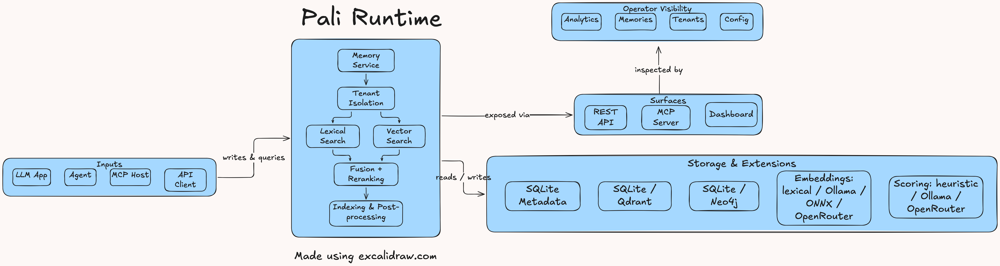

<div align="center">

# Pali


<a href="https://github.com/user-attachments/assets/704a5235-4782-4d50-bdc0-8e929ba1c8c3">
  
</a>

*Memory runtime for LLMs and agents. Self-hosted, inspectable, no cloud required.*

</div>

---

Most LLM memory solutions are either SaaS black boxes or bolted-on afterthoughts. Whereas Pali is a runtime you run yourself, with a dashboard you can actually look at, and retrieval you can tune without rewriting your app. Or even change the code in this repo ;D

It stores memories, retrieves the right ones (hybrid search: lexical + vector + reranking), keeps tenants isolated, and exposes everything over REST, MCP, or the Go/Python/JS SDKs. SQLite by default, Qdrant or Neo4j when you need them.


---

## Get started

```bash
curl -fsSL https://raw.githubusercontent.com/pali-mem/pali/main/scripts/install.sh | sh
pali init
pali serve
```

Windows:
```powershell
irm https://raw.githubusercontent.com/pali-mem/pali/main/scripts/install.ps1 | iex
```

Dashboard: [http://127.0.0.1:8080/dashboard](http://127.0.0.1:8080/dashboard)

From source:
```bash
git clone https://github.com/pali-mem/pali.git && cd pali
make setup && make run
```

Docker:
```bash
docker build -t pali:local .
docker run --rm -p 8080:8080 -v pali-data:/var/lib/pali pali:local
```

---

## Common commands

```bash
pali init          # creates pali.yaml and prepares the runtime
pali serve         # starts the API + dashboard
pali mcp serve     # MCP server mode for agent hosts
```

---

## SDKs

- **Go** — [`docs/client/README.md`](docs/client/README.md)
- **Python** — [`pali-mem/pali-py`](https://github.com/pali-mem/pali-py) · [PyPI](https://pypi.org/project/pali-client/)
- **JavaScript** — [`pali-mem/pali-js`](https://github.com/pali-mem/pali-js) · [npm](https://www.npmjs.com/package/pali-client)

---

## Backends and extensions

Everything is swappable through config:

| Layer | Options |
|---|---|
| Vector store | `sqlite`, `qdrant` |
| Graph store | `sqlite`, `neo4j` |
| Embeddings | `ollama`, `onnx`, `openrouter`, `lexical` |
| Importance scoring | `heuristic`, `ollama`, `openrouter` |

---

## Architecture

<details>
<summary>How it fits together</summary>

Requests come in through REST, MCP, or the dashboard. The memory service handles tenant isolation, then passes work to the retrieval pipeline — lexical + vector candidate fusion via RRF, then WMR reranking. Post-processing (parsing, embedding, scoring) runs async. Storage is SQLite by default with optional Qdrant/Neo4j.



</details>

---

## Docs

- [Getting started](https://pali-mem.github.io/pali/getting-started/)
- [Configuration](https://pali-mem.github.io/pali/configuration/)
- [MCP integration](https://pali-mem.github.io/pali/mcp/)
- [Deployment](https://pali-mem.github.io/pali/deployment/)
- [API reference](https://pali-mem.github.io/pali/api/)
- [Architecture](https://pali-mem.github.io/pali/architecture/)

---

## Build and test

```bash
make build
make test
make test-integration
```

---

## AI disclosure

Codex was used as an assistant during development. Decisions, review, and releases are on the maintainers.