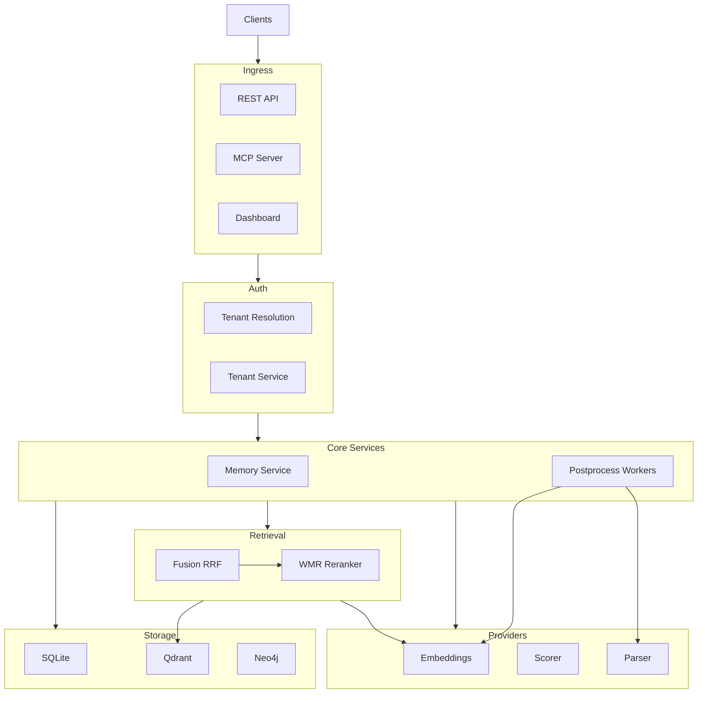

<div align="center">

# Pali

[](https://go.dev/)
[](LICENSE)
[](README.md)

<a href="https://github.com/user-attachments/assets/704a5235-4782-4d50-bdc0-8e929ba1c8c3">
  
</a>

*Open memory for your LLM.*

</div>

> **Pre-release, close to usable** — Pali is functional and the v0.1 release work is now mostly docs, benchmarks, and repo hygiene. APIs and config may still tighten before tagging.

## Read First

Read these before you deploy Pali:

1. [Why Pali](#why-pali)
2. [Current Core Capabilities (v0.1)](#current-core-capabilities-v01)
3. [Infrastructure-First Features](#infrastructure-first-features)
4. [Quickstart](#quickstart)
5. [Config](#config)
6. [Auth (Optional JWT)](#auth-optional-jwt)
7. [`docs/multitenancy.md`](docs/multitenancy.md)
8. [`docs/configuration.md`](docs/configuration.md)
9. [`docs/deployment.md`](docs/deployment.md)
10. [`docs/operations.md`](docs/operations.md)
11. [`docs/mcp.md`](docs/mcp.md)
12. [`BENCHMARKS.MD`](BENCHMARKS.MD)

## Infrastructure-First Features

Pali is infrastructure-first:
- Multi-tenant memory APIs with tenant-scoped isolation
- Hybrid retrieval across lexical, dense, fusion, reranking, and optional multi-hop expansion
- MCP server with memory-first tools and tenant-aware resolution
- Dashboard for operators inspecting tenants, memories, and system state
- Plug-and-play extension points for vector stores, embedders, entity-fact backends, and scoring/routing

### What That Means In Practice

- Multi-tenant memory APIs let one deployment serve many tenants while keeping request handling tenant-scoped.
- Hybrid retrieval lets you combine SQLite lexical recall, vector search, rank fusion, reranking, and optional graph/decomposition-assisted expansion behind one search API.
- MCP exposes the same memory core to agent hosts over stdio without inventing a separate memory stack.
- The dashboard gives operators a direct view of tenant and memory state from the running service.
- Extension points keep the app contract stable while letting you switch retrieval infrastructure through config.

The core is fully open source — built to be embedded, self-hosted, and extended.

## Why Pali

Most projects treat memory as an app feature. Pali treats it as foundational infrastructure:
- You can run it as a local service, in a container, or behind your own gateway.
- You can swap retrieval components without changing your app contract.
- You can use REST, MCP, or the Go client against the same memory core.
- You keep control of storage, tenancy boundaries, and model/provider decisions.

## Current Core Capabilities (v0.1)

- Memory CRUD and batch ingest APIs
- Async post-processing pipeline with job tracking
- Two-phase retrieval:
  - Lexical + dense candidate fusion via RRF
  - WMR reranking
- Tenant statistics and routing support
- Tier auto-resolution (`episodic` vs `semantic`) from deterministic signals
- Optional JWT tenant-scoped auth
- Operator dashboard with full visibility into tenant and memory flows

Operational notes:
- the dashboard lists persisted memories from the repository-backed memory store
- retrieval behavior shown through search can still use configured backends like Qdrant and Neo4j
- the dashboard is an operator surface and is not protected by the `/v1` JWT middleware today

## Plug-and-Play Extensions

| Layer | Options | Notes |
|---|---|---|
| Vector backend | `sqlite`, `qdrant` | `pgvector` is under work for next version |
| Graph backend (entity facts) | `sqlite`, `neo4j` | Batch-first entity fact writes; `sqlite` remains default |
| Embeddings | `ollama`, `onnx`, `lexical`, `openrouter` | `mock` alias is supported for legacy config |
| Importance scorer | `heuristic`, `ollama`, `openrouter` | Config-driven swap |
| Retrieval scoring | `wal`, `match` | Runtime algorithm switch |
| Parsing | `heuristic`, `ollama` | Optional extraction before persistence |
| Structured memory | observation/event dual-write | Optional query routing boosts |

## Architecture



## Quickstart

### 1) Prerequisites

- Go `1.24+`

### 2) Bootstrap local config and checks

```bash
make setup
```

### 3) Run the API server

```bash
make run
```

Default address: `http://127.0.0.1:8080`

Health:
```bash
curl http://127.0.0.1:8080/health
```

Dashboard:
```bash
open http://127.0.0.1:8080/dashboard
```

## Single-Binary Runtime (Optional)

Pali can also be run as a single compiled binary (helpful for ops and local packaging):

```bash
make build
./bin/pali -config pali.yaml
```

MCP server mode:

```bash
./bin/pali mcp run -config pali.yaml
```

Install into your PATH:

```bash
make install
pali -config /etc/pali/pali.yaml
```

User-local install (no sudo):

```bash
make install PREFIX="$HOME/.local"
export PATH="$HOME/.local/bin:$PATH"
pali -config pali.yaml
```

This is an installation/runtime convenience, not the project identity. The project is open memory infrastructure with fully extensible components.

## MCP Tooling

Current MCP toolset:
- `memory_store`
- `memory_store_preference`
- `memory_search`
- `memory_list`
- `memory_delete`
- `tenant_create`
- `tenant_list`
- `tenant_stats`
- `tenant_exists`
- `health_check`
- `pali_capabilities`

Built-in MCP guidance:
- `initialize.instructions` includes memory-first policy hints
- `prompts/get` exposes `pali_memory_autopilot`

Tenant-aware MCP tool resolution order:
1. `tenant_id` in tool input
2. JWT tenant claim (when auth is enabled)
3. MCP session default tenant
4. `default_tenant_id` in config
5. otherwise, tool returns an error

This is tenant resolution, not full operator auth delegation. REST auth is stricter; MCP behavior also depends on what the host forwards into session or tool metadata.

## Config

- Canonical guide: [`docs/configuration.md`](docs/configuration.md)
- Canonical template: [`pali.yaml.example`](pali.yaml.example)
- Local runtime file: `pali.yaml` (created by `make setup` if missing)
- Custom runtime file: `go run ./cmd/setup -config /path/to/pali.yaml`

## Embedding Setup Notes

- `make setup` checks configured embedder readiness
- `make setup` supports `-config` when you want to validate a non-default config path
- the committed default config uses `embedding.provider: lexical`, so first boot does not require Ollama, ONNX, or OpenRouter
- lexical is the easiest way to start, not the highest-quality retrieval setup
- ONNX model files are downloaded only when `embedding.provider=onnx` (unless forced)
- Ollama readiness checks run only when the current config enables an Ollama-backed component

Useful setup flags:

```bash
go run ./cmd/setup -download-model
go run ./cmd/setup -config /etc/pali/pali.yaml
go run ./cmd/setup -skip-model-download
go run ./cmd/setup -skip-runtime-check
go run ./cmd/setup -skip-ollama-check
```

If you use ONNX, required files are:
- `models/all-MiniLM-L6-v2/model.onnx`
- `models/all-MiniLM-L6-v2/tokenizer.json`

Ollama quick start:

```bash
ollama serve
ollama pull mxbai-embed-large
```

## Auth (Optional JWT)

```yaml
auth:
  enabled: true
  jwt_secret: "change-me"
  issuer: "pali"
```

JWT must include `tenant_id`, and request tenant must match token tenant.

Important behavior:
- one JWT maps to one tenant
- `/v1` routes return `403` on tenant mismatch
- MCP can also resolve tenant from session/default config when the host does not forward JWT metadata
- the dashboard is not currently fronted by the same JWT middleware

Full guide: [`docs/multitenancy.md`](docs/multitenancy.md)

Mint dev JWT:

```bash
go run ./cmd/jwt -tenant tenant_1
go run ./cmd/jwt -tenant tenant_1 -secret "change-me" -ttl 2h
TENANT=tenant_1 JWT_SECRET=change-me make jwt
```

## Go Client

```go
import (
  "context"
  "log"

  "github.com/pali-mem/pali/pkg/client"
)

func main() {
  c, err := client.NewClient("http://127.0.0.1:8080")
  if err != nil {
    log.Fatal(err)
  }

  ctx := context.Background()
  if _, err := c.CreateTenant(ctx, client.CreateTenantRequest{
    ID:   "tenant_1",
    Name: "Tenant One",
  }); err != nil {
    log.Fatal(err)
  }
}
```

When auth is enabled:

```go
c.SetBearerToken("<jwt>")
```

Client docs: [`docs/client/README.md`](docs/client/README.md)

## Repository Layout

- `cmd/pali`: main API server binary entrypoint
- `cmd/setup`: setup/bootstrap checks
- `internal/domain`: entities and interfaces
- `internal/core`: service and use-case layer
- `internal/repository/sqlite`: SQLite repository implementation
- `internal/vectorstore`: sqlite-vec and qdrant implementations
- `internal/embeddings`: embedding providers
- `internal/scorer`: importance scoring providers
- `internal/api`: Gin router, middleware, handlers, DTOs
- `internal/mcp`: MCP server and tool handlers
- `internal/dashboard`: dashboard handlers and templates
- `pkg/client`: Go API client SDK
- `test`: integration and e2e suites
- `docs`: architecture, API, MCP, deployment docs

## Build, Test, and Benchmark

Build:

```bash
make build
```

Tests:

| Command | Scope |
|---|---|
| `make test` | Unit tests (`internal/` and `pkg/`) |
| `make test-integration` | Integration tests (`-tags integration`) |
| `make test-e2e` | End-to-end tests (`-tags e2e`) |
| `make test-all` | Everything |

Release gate:

```bash
scripts/release_gate.sh
```

Release assets (downloadable executables + checksums):

```bash
VERSION=v0.1.0 make release-assets
```

Outputs:
- `dist/releases/<version>/artifacts/` (`.tar.gz` for Linux/macOS, `.zip` for Windows `.exe`)
- `dist/releases/<version>/SHA256SUMS`
- `dist/releases/<version>/manifest.json`
- `dist/releases/LATEST`

GitHub release automation:
- pushing a tag like `v0.1.0` triggers `.github/workflows/release.yml`
- the workflow builds Linux/macOS/Windows artifacts and attaches them to the GitHub Release automatically
- manual run is also supported via Actions `workflow_dispatch` (provide an existing tag)

## Production Readiness Checklist

- Keep `pali.yaml` outside the repo and inject sensitive values through your deployment platform.
- Set `auth.enabled: true` and a long, random `jwt_secret` in non-dev environments.
- Run with a process supervisor (systemd, Docker restart policy, Kubernetes) and explicit liveness/readiness checks.
- Put TLS termination at a reverse proxy (for example Nginx/Caddy) and keep Pali on an internal network.
- Use dedicated persistent storage for `database.sqlite_dsn`; `pali.db` must persist across restarts.
- Schedule DB backups and restore drills from file snapshots.
- Enable monitoring on `/health` and track startup logs for counts and migration status.
- Gate promotion with config validation (`go run ./cmd/setup -config pali.yaml`) before rollout.
- Pin runtime dependencies and avoid running unverified `model.onnx`/`tokenizer.json` artifacts from untrusted sources.
- Run integration smoke checks against `/health`, `POST /v1/tenants`, and `POST /v1/memory/search` after deploy.

Benchmarks:

```bash
make bench-setup
make benchmark
make retrieval-quality
make bench-suite
```

Canonical release assets:

- `testdata/benchmarks/fixtures/release_memories.json`
- `testdata/benchmarks/evals/release_curated.json`
- `test/benchmarks/profiles/`
- `test/benchmarks/suites/`

Result output: `test/benchmarks/results/<timestamp>/`
Each run now includes `config.profile.yaml` and `config.rendered.yaml`.

Suite output: `test/benchmarks/results/suites/<timestamp>-<suite>/`
Each suite run includes a combined `suite.json` and `suite.summary.md` scorecard.

## Docs

- Published docs site: [https://pali-mem.github.io/pali/](https://pali-mem.github.io/pali/)
- Local docs map: [`docs/README.md`](docs/README.md)
- Local docs preview:

  ```bash
  pip install -r docs/requirements.txt
  mkdocs serve
  ```

- Multi-tenant auth and isolation: [`docs/multitenancy.md`](docs/multitenancy.md)
- Operations/runbook: [`docs/operations.md`](docs/operations.md)
- Configuration guide: [`docs/configuration.md`](docs/configuration.md)
- MCP notes: [`docs/mcp.md`](docs/mcp.md)
- Deployment guide: [`docs/deployment.md`](docs/deployment.md)
- API reference: [`docs/api.md`](docs/api.md)
- Architecture: [`docs/architecture.md`](docs/architecture.md)
- ONNX setup: [`docs/onnx.md`](docs/onnx.md)
- Go client docs: [`docs/client/README.md`](docs/client/README.md)
- Benchmark policy: [`BENCHMARKS.MD`](BENCHMARKS.MD)
- Research/dependencies: [`ACKNOWLEDGEMENTS.md`](ACKNOWLEDGEMENTS.md)

## Module Path

`github.com/pali-mem/pali`
